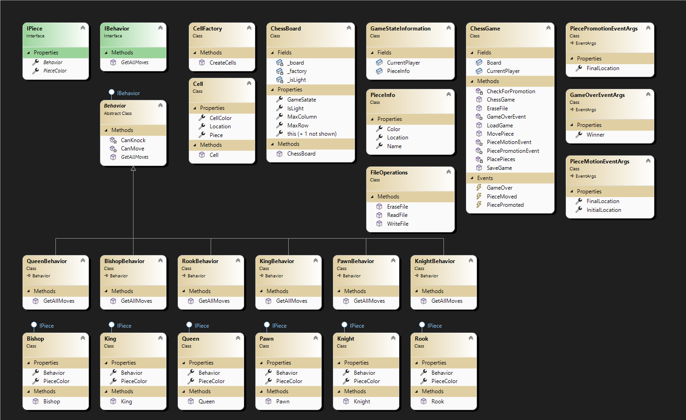

# Chess Game Application

This is a Chess Game application developed in C#. The application is divided into two main parts: ChessLibrary and ChessUI.

## ChessLibrary

The ChessLibrary is the core of the application. It contains all the logic for the chess game, including the behaviors of the pieces, the game state, and the rules of the game.

### Key Components

- `Behaviors`: This directory contains classes that define the behavior of each chess piece. Each piece has its own class, such as QueenBehavior, KingBehavior, and PawnBehavior. There's also an interface IBehavior that all piece behaviors implement.

- `Cell.cs` and `CellFactory.cs`: These files manage the cells of the chessboard.

- `ChessBoard.cs` and `ChessGame.cs`: These files manage the game state and the rules of the game.

- `FileOperations.cs`: This file manages file operations, such as saving and loading game states.

## ChessUI

The ChessUI is the user interface for the application. It provides a visual representation of the chessboard and allows the user to interact with the game.

### Key Components

- `ChessUI.cs`: This is the main file for the user interface. It handles user input and updates the display.

- `ChessUI.Designer.cs` and `ChessUI.resx`: These files are used for the design and resources of the user interface.

- `ChessBoardState.json`: This file stores the current state of the chessboard.

## How to Run

To run this application, you need to have .NET Framework installed on your machine. Open the solution file ChessLibrary.sln or ChessUI.sln in Visual Studio and press `F5` to start debugging.

## Contributing

If you'd like to contribute to this project, please feel free to fork the repository and submit a pull request. We also welcome any issues you find.

## License

This project is licensed under the MIT License.